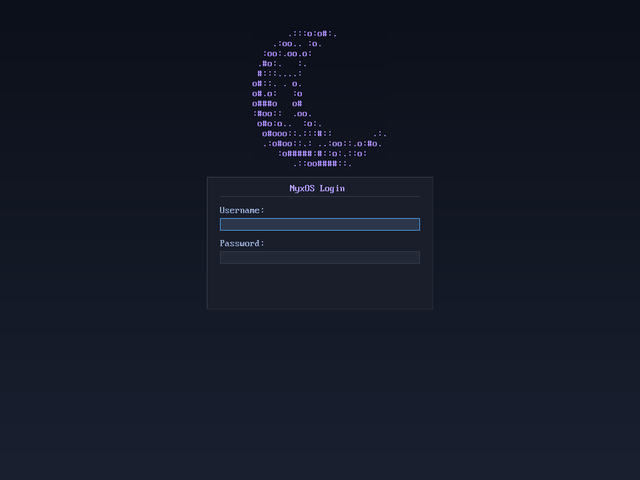
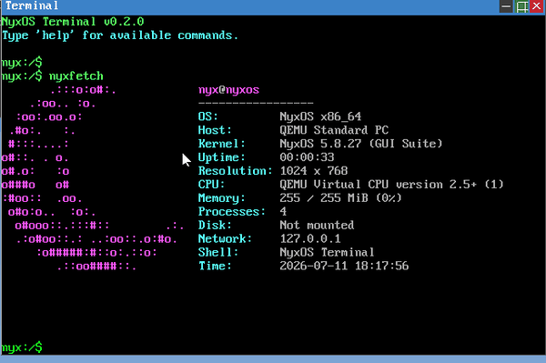

<div align="center">
  
</div>

<div align="center">
  <strong>Custom x86_64 kernel · C and Assembly · General-purpose OS</strong>
  <br/><br/>
  <!-- Badges -->
  <a href="https://github.com/kazah-png/nyx-os/releases/tag/v5.8.18">
    
  </a>
  
  
  
  
  <a href="https://github.com/kazah-png/nyx-os/issues/1">
    
  </a>
  <a href="https://dsc.gg/nyxos">
    
  </a>
  <a href="https://kazah-png.github.io/nyx-os/">
    
  </a>
  <a href="https://github.com/kazah-png/nyx-os/wiki">
    
  </a>
</div>

---

## NyxOS — Terminal Preview

```
nyx:root$ nyxfetch

______          \'/
      .-'` .    `'-.    -= * =-
    .'  '    .---.  '.    /|\
   /  '    .'     `'. \
  ;  '    /          \|
 :  '  _ ;            `
;  :  /(\ \
|  .       '.
|  ' /     --'
|  .   '.__\
;  :       /
 ;  .     |            ,
  ;  .    \           /|
   \  .    '.       .'/
    '.  '  . `'---'`. `'
      `'-..._____.-'
    N Y X O S
    G U I   S U I T E
  -------------------------------------
  Kernel:     NyxOS 5.8.18
  Arch:       x86_64 (long mode)
  Memory:     256 MB total, 240 MB free
  Heap:       16384 KB
  Paging:     Enabled
  NX+SMEP:    Enabled
  Uptime:     42 ticks
  -------------------------------------
```

---

## About

**NyxOS** is a from-scratch x86_64 kernel built as a general-purpose OS for low-level systems programming. It boots via Multiboot (GRUB-compatible), runs in long mode with 4-level paging, and provides a clean foundation for kernel development.

The project implements core kernel primitives, a custom network stack (RTL8139 NIC + ARP/IP/UDP/ICMP/DHCP + TCP), a window compositor GUI, and a Sound Blaster 16 audio driver — all written in C and x86_64 Assembly with no external libraries.

<div align="center">
  
  <p><em>NyxOS Desktop — 8 app icons, sky-blue wallpaper, taskbar</em></p>
</div>

---

## See it in action

<table>
<tr>
<td width="50%" valign="top">

<p align="center"><em>Boot → login → windowed desktop (compositor GUI)</em></p>
</td>
<td width="50%" valign="top">

<p align="center"><em>Live shell — <code>nyxfetch</code>, <code>ls</code>, <code>ps</code>, <code>mem</code></em></p>
</td>
</tr>
</table>

<div align="center">
  
  <p><em>Ring-3 process model — fork · pipe · execve · dup2 · lazy sbrk · coreutils · signals · mmap (real serial output)</em></p>
</div>

---

## Tech stack

**Languages**


**Toolchain**


**Kernel primitives**


**Network stack**


---

## Shell session preview

```
nyx:root$ help
Available commands:
  help           - Show this help
  version        - Show kernel version
  clear          - Clear the screen
  nyxfetch       - Show system info with ASCII logo
  echo           - Print a line of text
  ls             - List directory contents
  cd             - Change directory
  pwd            - Print working directory
  cat            - Display file contents
  touch          - Create empty file
  mkdir          - Create directory
  rm             - Remove file or directory
  cp             - Copy file
  mv             - Move/rename file
  which          - Show path of a command
  head           - Show first lines of a file
  tail           - Show last lines of a file
  grep           - Search file contents
  sort           - Sort lines of a file
  wc             - Count lines/words/chars
  tree           - Show filesystem tree
  find           - Find files by name
  write          - Write text to file
  history        - Show command history
  ps             - List processes
  mem            - Show memory usage
  ifconfig       - Show network interfaces
  dhcp           - Request IP via DHCP
  ping           - Ping a host
  ...

nyx:root$ echo Hello, NyxOS!
Hello, NyxOS!

nyx:root$ echo test > /readme.txt

nyx:root$ cat /readme.txt
test

nyx:root$ ls /
bin/   dev/   etc/   home/  mnt/   root/  tmp/   usr/   var/

nyx:root$ uname
NyxOS 5.8.18 (Scheduler) x86_64

nyx:root$ mem
Physical memory: 256 MB total, 252 MB free
Heap size: 1024 KB

nyx:root$ ps
PID  PPID STATE NAME
1    0    1     init

nyx:root$ history
  1  help
  2  echo Hello, NyxOS!
  3  echo test > /readme.txt
  4  cat /readme.txt
  5  ls /
  6  uname
  7  mem
  8  ps
  9  history

nyx:root$ export NAME=NyxOS

nyx:root$ echo $NAME
NyxOS

nyx:root$ touch /hello.txt && write /hello.txt Hello World

nyx:root$ sort /hello.txt
Hello World

nyx:root$ ifconfig
lo:   IP 127.0.0.1    MAC 00:00:00:00:00:00   MTU 65536
eth0: IP 10.0.2.15    MAC 52:54:00:12:34:56   MTU 1500

nyx:root$ diff /a.txt /b.txt
< line1 from a
> line1 from b
---
1 line(s) differ

nyx:root$ beep 440 500
Beep: 440 Hz for 500 ms

nyx:root$ play
Playing melody...
Done.
```

---

## Features

### Boot & initialization
- Multiboot-compliant (GRUB-ready)
- x86_64 long mode with GDT setup (64-bit code/data, TSS)
- 4-level paging with identity + higher-half kernel mapping (PML4[256] mirror)
- Full IDT with exception handlers and IRQ remapping
- PIT timer at 1000 Hz (interrupt-driven)
- APIC timer support (Local APIC + I/O APIC initialization)
- PS/2 keyboard driver (US and ES layouts + AltGr)
- PS/2 mouse driver (IRQ12, 3-byte packets, absolute positioning)
- PC speaker driver (PIT channel 2, square wave, beep/melody)
- Real-time clock (RTC) driver — CMOS RTC via ports 0x70/0x71, binary/24h init

### Memory management
- Bitmap-based physical page allocator (supports up to 512 MB)
- Kernel heap (`kmalloc`/`kfree`) with first-fit + block splitting + coalescing (16 MB heap)
- Identity-mapped page tables (64 MB) + higher-half kernel mapping
- Per-process page directories (user PML4 clones kernel higher half only)
- User/kernel page-table isolation (user has no identity mapping, CR3 switching in ISR/IRQ/syscall)
- NX bit (No-Execute) on user stack/heap/data pages, SMEP (Supervisor Mode Execution Prevention)

### Process management
- Static process table (up to 512 processes)
- PID/PPID tracking, process states
- Preemptive multitasking via IRQ scheduler tick (1000 Hz)
- Context switching (`switch_context`/`create_task_stack` assembly)
- Background task callbacks for periodic work

### ELF userspace & syscalls (v3.0.0+)
- **ELF64 loader** — validates, parses PT_LOAD segments, maps pages per-process
- **Initramfs** — embedded cpio archive with ELF64 binaries (init.elf, hello.elf)
- **27 syscalls** via `syscall`/`sysret`: `exit`, `write`, `print`, `open`, `read`, `close`, `getpid`, `sbrk`, `fsize`, `exec`, `fork`, `waitpid`, `pipe`, `execve`, `dup2`, `getdents`, `kill`, `signal`, `sigreturn`, `mmap`, `munmap`, `chdir`, `getcwd`, `mkdir`, `unlink`, `ttymode`, `mprotect`
- **C runtime** — minimal libc with `printf`, `sprintf`, `snprintf`, `malloc`, `free`, string/memory functions
- **Auto-boot init** — kernel loads and executes `/init.elf` from initramfs at startup
- **Ring 3 execution** — user processes run in ring 3, I/O ports denied via TSS I/O map base
- **sbrk heap** — per-process heap via page allocation in user page directory

### Shell & commands
Built-in command interpreter with **40+ commands**:

| Category | Commands |
|----------|----------|
| **System** | `help`, `clear`, `nyxfetch`, `uname`, `date`, `version`, `reboot`, `crash` |
| **Files** | `ls`, `cd`, `pwd`, `cat`, `touch`, `mkdir`, `rm`, `cp`, `mv`, `head`, `tail`, `grep`, `sort`, `wc`, `find`, `tree`, `write`, `which`, `diff` |
| **Process** | `ps`, `kill`, `mem`, `exec` |
| **Network** | `ifconfig`, `dhcp`, `ping`, `setip`, `tcptest` |
| **Graphics** | `mode`, `gui`, `fonttest`, `desktop` |
| **Sound** | `beep`, `play`, `sb16play` |
| **Misc** | `echo`, `env`, `export`, `history`, `hexdump`, `layout`, `doom` |

**Shell features:**
- Tab completion for command names
- Environment variable expansion (`$VARNAME`)
- Command history (last 10, duplicates filtered)
- `echo text > file` redirection support
- Pipe `\|` support (`cmd1 \| cmd2` with temp file)

### Network stack (real)
- **RTL8139 NIC driver** — PCI detection, I/O BAR, MMIO, TX/RX ring buffers, link detection, CONFIG1 fix
- **ARP** — Cache with request/reply, static entries, periodic cleanup
- **IPv4** — Send/receive with header checksum, local delivery
- **UDP** — Raw datagram send, port-based listener registration
- **ICMP** — Echo request/reply (ping)
- **DHCP** — Full client (DISCOVER → OFFER → REQUEST → ACK), auto-configures IP/netmask/gateway
- **TCP** — Full connection state machine (CLOSED, SYN_SENT, ESTABLISHED, FIN_WAIT, CLOSE_WAIT, TIME_WAIT), 8 concurrent connections, HTTP GET support
- **Interface** — `ifconfig` for status, static IP via `setip` or DHCP-assigned

### GUI subsystem (v2.2.0+)
- **Bochs VBE framebuffer** — Up to 1024x768x32, LFB at 0xE0000000
- **Auto-boot desktop** — NyxOS Desktop launches automatically at startup
- **Framebuffer abstraction** — `put_pixel`, `fill_rect`, `blit`, `fb_rgb`
- **PS/2 mouse** — IRQ12-driven, 3-byte packet decode, absolute cursor positioning
- **VGA 8x16 bitmap font** — Full 256-glyph set from Linux kernel font data
- **Window compositor** — 32 windows, z-ordering, title bars (min/max/close), drag-to-move, resize, 4 workspaces
- **Taskbar** — Running app buttons, Start menu (12 items), clock display
- **Desktop icons** — Files, Terminal, DOOM, Settings, About, Paint
- **Terminal emulator window** — 2000-line scrollback, Tab completion, full command execution
- **File Manager window** — VFS directory browsing, click navigation, file preview
- **GUI paint demo** — 6-color mouse-driven drawing with Bresenham lines
- **PC speaker** — PIT channel 2 tone generation, musical note definitions

### EXT2 filesystem (v2.3.0)
- **VFS mount layer** — `vfs_mount()` with filesystem driver dispatch
- **Auto-mount** — EXT2 partitions auto-detected and mounted at `/mnt` on boot
- **Standard commands** — `ls /mnt`, `cd /mnt`, `cat /mnt/...` all work transparently
- **Block group support** — Multiple block groups, indirect/double-indirect blocks
- **Block sizes** — Supports 1024, 2048, and 4096 byte blocks
- **Mount command** — Manual mount via `mount [drive] [part_lba]`

---

## Project structure

```
nyx-os/
├── kernel/
│   ├── boot.asm          # Multiboot header, entry point
│   ├── kernel.c          # Main kernel, shell (40+ commands), desktop launch
│   ├── kernel.h          # Core header (types, structs, inline funcs)
│   ├── gdt.c / gdt_flush.asm / idt.c / idt_load.asm
│   ├── isr.c / isr_stubs.asm / irq.c
│   ├── memory.c          # Physical memory manager (bitmap allocator)
│   ├── heap.c            # 16 MB kernel heap allocator
│   ├── paging.c          # Page tables, virtual memory
│   ├── process.c         # Process management + background tasks
│   ├── switch.asm        # Context switch assembly
│   ├── syscall.c         # System calls (9 handlers via int 0x80)
│   ├── vfs.c             # Ramdisk VFS + mount table + pipe
│   ├── ext2.c / ext2.h   # EXT2 filesystem driver (read/write)
│   ├── ata.c / ata.h     # ATA/IDE PIO disk driver (read/write)
│   ├── dhcp.c            # DHCP client
│   ├── net.c / tcp.c / tcp.h / udp.c / ip.c / ethernet.c
│   ├── arp.c / icmp.c / rtl8139.c
│   ├── timer.c           # PIT timer (1000 Hz, interrupt-driven)
│   ├── keyboard.c        # PS/2 driver (US/ES layouts, AltGr)
│   ├── screen.c          # VGA text mode (80x25) + putchar hook
│   ├── serial.c          # COM1 debug stub
│   ├── rtc.c             # CMOS RTC driver
│   ├── vbe.c             # Bochs VBE framebuffer driver
│   ├── fb.c              # Framebuffer abstraction
│   ├── mouse.c           # PS/2 mouse driver (IRQ12)
│   ├── gui.c             # GUI paint demo with mouse
│   ├── font.c / font.h   # VGA 8x16 bitmap font (256 glyphs)
│   ├── compositor.c / compositor.h  # Window compositor (32 windows)
│   ├── terminal_win.c / terminal_win.h  # Terminal emulator window
│   ├── fileman_win.c / fileman_win.h    # File Manager window
│   ├── speaker.c / speaker.h    # PC speaker driver
│   ├── sb16.c / sb16.h          # Sound Blaster 16 driver (DMA/IRQ)
│   ├── elf.c / elf.h     # ELF32 loader for userspace binaries
│   ├── initramfs.c / initramfs.h  # Initramfs cpio parser
│   ├── initramfs_data.h  # Generated embedded initramfs archive
│   ├── vga_graphics.c    # VGA mode 13h (DOOM)
│   ├── doom_nyxos.c / doom_nyxos_sound.c  # DOOM generic port
│   └── doom_src/         # DOOM engine source
├── user/
│   ├── crt0.asm          # CRT0 for userspace ELF binaries
│   ├── syscall.h         # Syscall inline wrappers
│   ├── libc.h / libc.c   # Minimal C library (printf, malloc, string, stdio, stdlib)
│   ├── init.c            # Init program (first userspace process)
│   ├── hello.asm         # Test ELF binary
│   └── makefile          # User-space build rules (included by kernel/Makefile)
├── tools/
│   ├── build.sh          # ISO builder (grub-mkrescue)
│   ├── mkinitramfs.py    # Initramfs cpio generation script
│   ├── qemu_launch.ps1   # Windows QEMU launcher
│   └── qemu_launch.sh    # Linux QEMU launcher
├── build.ps1             # Windows build script
├── run.ps1               # Windows QEMU launcher (gui/serial/net)
├── AGENTS.md             # Agent context for AI-assisted development
├── Makefile              # Top-level build
└── README.md
```

---

## Build & run

### Prerequisites

```
x86_64-elf-gcc / x86_64-elf-ld (cross-compiler) or host GCC with -m64
nasm  (>= 2.14)
GNU make
QEMU  (>= 8.0, for emulation)
```

### Build

**Linux/WSL:**
```bash
git clone https://github.com/kazah-png/nyx-os.git
cd nyx-os
make -C kernel
```

**Windows (PowerShell):**
```powershell
.\build.ps1
```
*(Requires WSL with cross-compiler at `cross/bin/`)*

### Run in QEMU

**Quick serial test:**
```bash
qemu-system-x86_64 -kernel kernel/nyx-kernel.bin -m 512M -no-reboot -serial stdio
```

**With GUI (desktop):**
```bash
qemu-system-x86_64 -kernel kernel/nyx-kernel.bin -m 512M -no-reboot
```

**With networking:**
```bash
qemu-system-x86_64 -kernel kernel/nyx-kernel.bin -m 512M -nic user,model=rtl8139
```

**With sound + disk + network:**
```bash
qemu-system-x86_64 -kernel kernel/nyx-kernel.bin -m 512M -hda ext2-test.img -nic user,model=rtl8139 -audiodev dsound,id=audio0 -device sb16,audiodev=audio0
```

**Windows (PowerShell):**
```powershell
.\run.ps1                  # GUI mode (default)
.\run.ps1 -Mode serial     # Serial debug output
.\run.ps1 -Mode net        # With RTL8139 networking
.\run.ps1 -Mode net -Sound # Networking + SB16 sound
```

---

## Status

See the full **[NyxOS Status Report](https://github.com/kazah-png/nyx-os/issues/1)** for a detailed feature checklist.

### What works
- ✅ Full boot sequence with animation and login screen → GUI desktop (or text shell fallback)
- ✅ 40+ shell commands with Tab completion, env vars, pipes, history
- ✅ Ramdisk VFS + EXT2 read/write (auto-mount at /mnt)
- ✅ Real networking (RTL8139 + ARP/IP/UDP/ICMP/DHCP/TCP)
- ✅ Window compositor (32 windows, workspaces, taskbar, Start menu)
- ✅ Terminal emulator window with scrollback and command execution
- ✅ File Manager window with VFS directory browsing and scrollbar
- ✅ Interrupt-driven timer (PIT + APIC), keyboard, mouse
- ✅ Sound Blaster 16 DSP detection, DMA programming, mixer, PCM playback
- ✅ DOOM game (VGA mode 13h, doomgeneric port) with SB16 sound
- ✅ PC speaker tones and melodies
- ✅ VBE framebuffer (1024x768x32)
- ✅ Bitmap font rendering
- ✅ x86_64 long mode, 4-level paging, higher-half kernel mapping
- ✅ User/kernel page-table isolation, CR3 switching in ISR/IRQ/syscall
- ✅ NX bit (No-Execute) + SMEP (Supervisor Mode Execution Prevention)
- ✅ Local APIC + I/O APIC initialization
- ✅ ELF64 userspace loader with initramfs (auto-boot init.elf)
- ✅ 27 syscalls via syscall/sysret (…, mkdir, unlink, ttymode, mprotect)
- ✅ Minimal C library for userspace (printf, malloc, free, snprintf, string ops)
- ✅ Real-time clock (RTC) driver with wall-clock time display
- ✅ Desktop polish (wallpaper, right-click context menu, Settings window, File Manager toolbar)
- ✅ Preemptive weighted round-robin scheduler (`nice`/`renice`, idle CPU yield)
- ✅ Shell job control: `exec` (foreground), `spawn` (background), `kill`, `jobs`, `wait`
- ✅ Per-process file descriptors (isolated, auto-closed on exit)
- ✅ Full TCP stack: retransmission (RTO), passive open (`listen`/`accept`), loopback
- ✅ DNS resolution & HTTP client
- ✅ Loopback networking & ICMP echo replies (`ping` with RTT/loss stats)
- ✅ File Manager: copy/paste, drag-and-drop into folders
- ✅ Ring 3 userspace execution with validated syscall args (no kernel handle leaks)

### Known issues
- ⚠️ **Login stability:** login screen works but may have edge cases with very fast typing or buffer overflow.

### What's being built
- ✅ SMP multi-core bringup (INIT-SIPI-SIPI + trampoline → long mode; verified with `-smp 4`, `cpus` command) — next: per-CPU scheduling to run threads on the APs
- ✅ Demand paging + copy-on-write via the #PF handler (verified with the `cowtest` self-test; CR0.WP enabled)
- ✅ Copy-on-write `fork()` (`SYS_FORK`): physical page refcounting + COW address-space clone; child resumes with `fork()==0`, both round-robin (verified in `/init.elf` — parent/child diverge on a shared variable)
- ✅ `waitpid()` (`SYS_WAITPID`): a parent reaps a child and collects its exit code from ring 3 (verified: child `exit(123)` → parent `waitpid` → code 123, no leaked zombie)
- ✅ Per-process syscall stacks: each process's `syscall` uses its own kernel stack, so a syscall can truly **block** (`waitpid` sleeps instead of polling) without another process corrupting its parked frame — foundation for blocking I/O
- ✅ Anonymous pipes (`SYS_PIPE`) + blocking `read()`: `pipe()` + `fork()` gives a real cross-process byte channel (verified: parent `write`s → child `read`s `"hello from parent via pipe!"`); reference-counted ends, EOF on last-writer close — enables shell pipelines
- ✅ `execve()` (`SYS_EXECVE`): replaces the caller's process image in place (same pid/fds) — completes `fork`→`exec`→`wait` (verified: child `fork`s then `execve`s `/hello.elf`, which runs + `exit(42)`, parent `waitpid`s the 42)
- ✅ `dup2()` (`SYS_DUP2`): fd redirection onto stdin/stdout — the pipeline primitive (verified: child `dup2`s a pipe onto fd 1, its `write(1, …)` lands in the pipe and the parent reads `"stdout was redirected!"`)
- ✅ `execve()` argv passing: SysV entry stack (`[argc][argv…][NULL]`, crt0 reads `[rsp]`) — programs receive real command-line arguments (verified: `execve("/args.elf", {"args","uno","dos","tres"})` prints all 4 and exits with argc=4)
- ✅ **Interactive userspace shell** (`/sh.elf` + `/echo.elf` + `/upper.elf`): a live ring-3 REPL — `read(0)` reads the keyboard (canonical line discipline: echo + backspace), wiring `a | b` with fork+execve+waitpid+pipe+dup2 (verified live: typed `echo hola nyx` → `hola nyx`, `echo … | upper` → `UPPERCASE`, `exit`)
- ✅ Lazy `sbrk` (demand-paged heap): `SYS_SBRK` just moves the break; heap pages fault in on first touch (`[heap_start, program_break)` window in the #PF handler) — a big `malloc` costs only the pages actually written (verified: `malloc(8000)` grows the break 3 pages lazily, data intact)
- ✅ **Coreutils** (`/cat.elf`, `/wc.elf`, `/ls.elf`) + shell **background jobs** (`cmd &`): `ls` via a new `SYS_GETDENTS` (kernel does the `vfs_open`/`readdir`/`close`, copies fixed 68-byte records to ring 3); `cat`/`wc` stream files or stdin; a trailing `&` runs a pipeline in the background via non-blocking `waitpid(…, WNOHANG)` — `[bg] pid N` at launch, `[done] pid N` reaped at the next prompt (verified: `ls /` lists dirs + all `.elf`s, `cat welcome.txt | wc` → `1 4 26`, `echo … | upper &` backgrounds and both stages reap)
- ✅ **Signals** (`kill`/`signal`/`sigreturn`): POSIX-style signals delivered at return-to-ring-3 — a user handler is entered by rewriting the saved frame (RIP=handler, RDI=signo) with a crt0 trampoline that returns through `SYS_SIGRETURN`; `SIG_DFL` terminates (exit `128+signo`), `SIG_IGN` drops. **Ctrl-C** posts SIGINT to the foreground process and interrupts a blocking `read(0)` (verified: SIGUSR1 handler runs then control returns to main, `kill(child, SIGTERM)` → status 143, and Ctrl-C at the shell prints `^C` + a fresh prompt without killing it)
- ✅ **`mmap`/`munmap`** (anonymous, demand-zero): `mmap` records a VMA and returns a base VA (in `[4 GiB, 112 TiB)`, clear of the heap and stack) — pages fault in as zeroed on first touch via the same #PF handler as lazy `sbrk`, with prot honored (writable only if `PROT_WRITE`, `NX` unless `PROT_EXEC`); `munmap` frees them (refcount-aware). `fork` inherits mappings COW, `execve` drops them (verified: `mmap(12288)` → `0x100000000`, demand-zero, r/w intact across 3 pages, then `munmap`)
- ✅ **Shell I/O redirection** (`>` `>>` `<`) + coreutils `grep`/`head`/`tail`: the userspace shell (`/sh.elf`) parses redirections and `dup2`s an `open`'d file onto stdin/stdout; `dup2` now moves VFS handles (pipes still refcount-duplicate), backed by `O_TRUNC`/`O_APPEND` for `>`/`>>` (verified: `echo … > f`, `>> f`, `ls / | grep elf`, `cat f | head -n 1`, `cat f | wc` → `2 6 37`)
- ✅ **Per-process working directory** + shell `cd`/`pwd`/`export`/`$VAR`: each process has a cwd (`chdir`/`getcwd`), and relative paths in `open`/`getdents` resolve against it (with `.`/`..` normalization); inherited across `fork`, kept across `execve`. The shell adds in-process `cd`/`pwd`/`export` builtins and `$VAR`/`$?` expansion (verified: `cd /home/user` then `cat welcome.txt` opens the relative path, `export NAME=NyxOS` + `echo $NAME` → `NyxOS`)
- ✅ **Userland file tools** (`mkdir`/`rm`/`touch`/`sort`/`find` as ring-3 programs): new `mkdir`/`unlink` syscalls (cwd-relative), `sort` reorders lines from stdin or files, `find` walks directory trees recursively over `getdents` with an optional name filter — plus a real VFS fix (unlink/rename of nested directories resolved the wrong parent) found by wiring them (verified: `mkdir /tmp/proj`, `touch`, `find /tmp` lists the tree, `ls /tmp/proj | sort` → `a.txt b.txt`, `rm` both)
- ✅ **Shell line editing + history** (raw tty): `ttymode(TTY_RAW)` gives byte-at-a-time, no-echo stdin with arrows as ANSI escapes; the shell's `readline()` renders its own line — **↑/↓ walks a 16-entry history**, **←/→/Home/End move the cursor**, insert/delete anywhere in the line. Fixed a driver bug found live: the keyboard's E0-prefix check ran after the press-bit mask, so extended keys never worked anywhere (verified: ↑↑+Enter reruns `echo first`; `echo abcd` + ←← + backspace runs `echo acd`)
- ✅ **Shell Tab completion** (pure userspace, over `getdents`): completes command names (builtins + `/`'s `.elf`s, pipeline-aware after `\|`) and filesystem paths; a unique match fills in with a trailing space or `/`, several extend to the longest common prefix or list the candidates (verified: `ec`+Tab → `echo`; `t`+Tab → `tail  touch`; `ls /ho`+Tab → `ls /home/`)
- ✅ **File-backed `mmap` + `mprotect`**: mapping a file (`mmap(…, fd, …)` without `MAP_ANONYMOUS`) snapshots it into a per-VMA kernel buffer, and demand-faulted pages copy their slice from it — so reading the mapping returns file contents (the buffer is freed on munmap/exit, deep-copied on fork). `mprotect(addr,len,prot)` rewrites present-page flags and the VMA's prot (verified: `mmap(welcome.txt)` reads back the file; an `PROT_READ` page + `mprotect(RO→RW)` then accepts a write) — next: `/dev` special files, ELF shared libc
- ✅ NIC-side TCP listen (inbound connections — NyxOS serves HTTP to a host `curl` via `hostfwd`)
- ✅ **Nyx C language runtime** (`nyxrt.h`/`nyxrt.c`): typed subset of C with string interpolation, transpiles to C, first `.nyx` program (`hello_nyx.elf`) prints "hola desde nyx c! pid=5"

---

## Contributors

| Role | GitHub |
|------|--------|
| **Main Developer** | [@kazah-png](https://github.com/kazah-png) |
| **Bug Finder** | [@Voliox86](https://github.com/Voliox86) |
| **Art & Design** | [@kurawi-debug](https://github.com/kurawi-debug) |

---

## Community

Join the **NyxOS Discord** to follow development, ask questions, or contribute:

[](https://dsc.gg/nyxos)

- **Server:** [dsc.gg/nyxos](https://dsc.gg/nyxos)
- **Topics:** Kernel development, OS design, networking, low-level programming
- **Channel:** `#nyxos-dev` for build issues and feature discussions

---

## License

This project is free software: you can redistribute it and/or modify it under the terms of the **GNU General Public License** as published by the Free Software Foundation, either version 2 of the License, or (at your option) any later version.

The kernel links against doomgeneric (Chocolate Doom-derived), which is GPL-2.0+. All original kernel code is also distributed under GPL-2.0+.

See the [LICENSE](LICENSE) file for the full license text

---

<div align="center">
  
</div>
