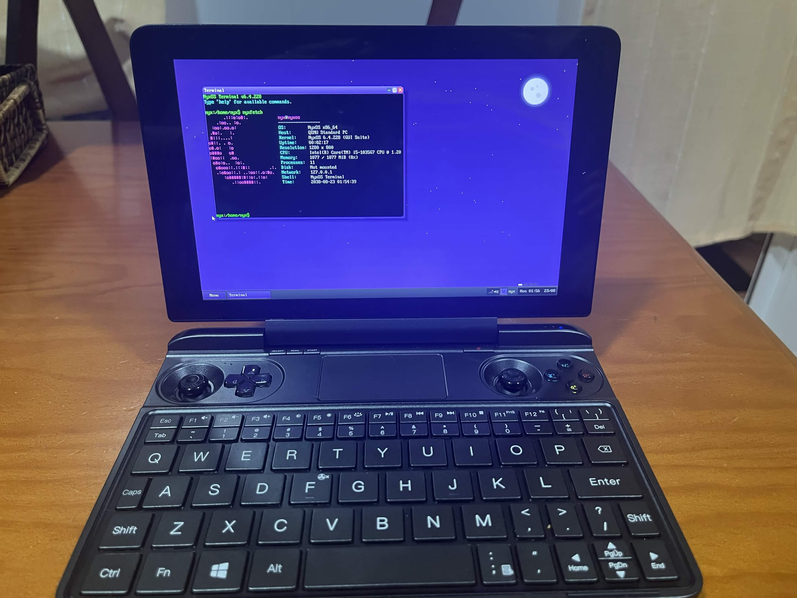

<div align="center">
  
</div>

<p align="center"><strong>A from-scratch x86_64 operating system · C and Assembly · GUI desktop, real network stack, and a self-hosting C toolchain</strong></p>

<p align="center">
  <a href="https://github.com/kazah-png/nyx-os/releases/tag/v5.9.0-LTS"></a>
  &nbsp;
  
  &nbsp;
  
  &nbsp;
  
  &nbsp;
  <a href="lang/README.md"></a>
  &nbsp;
  <a href="lang/README.md"></a>
</p>

<p align="center">
  <a href="https://github.com/kazah-png/nyx-os/actions/workflows/build.yml"></a>
  &nbsp;
  <a href="https://github.com/kazah-png/nyx-os/actions/workflows/codeql.yml"></a>
</p>

<p align="center">
  <a href="https://dsc.gg/nyxos"></a>
  &nbsp;
  <a href="https://nyxos.cc"></a>
  &nbsp;
  <a href="https://github.com/kazah-png/nyx-os/wiki"></a>
  &nbsp;
  <a href="https://nyxos.cc/support.html"></a>
</p>

---

## About

**NyxOS** is a from-scratch x86_64 operating system written in C and x86_64 Assembly, with no external libraries. It boots via Multiboot (GRUB) into long mode with 4-level paging and full user/kernel isolation, and provides a preemptive multitasking kernel, a ring-3 POSIX-style userspace, a real TCP/IP network stack, a windowed desktop, and an in-OS C compiler that builds — and rebuilds itself — entirely inside the running system.

<div align="center">
  
  <p><em>The NyxOS desktop — the terminal running <code>nyxfetch</code>, the Nightfall wallpaper, and the taskbar</em></p>
</div>

---

## See it in action

<table>
<tr>
<td width="50%" valign="top">

<p align="center"><em>Login → windowed desktop → <code>nyxfetch</code></em></p>
</td>
<td width="50%" valign="top">

<p align="center"><em>Live shell in color — <code>nyxfetch</code>, <code>ls</code>, <code>ps</code></em></p>
</td>
</tr>
</table>

```
nyx:root$ nyxfetch

       .:::o:o#:.           nyx@nyxos
    .:oo.. :o.              -----------------
  :oo:.oo.o:                OS:         NyxOS x86_64
 .#o:.   :.                 Kernel:     NyxOS 6.4.253
 #:::....:                  Uptime:     00:00:11
o#::. . o.                  Resolution: 1024 x 768
o#.o:   :o                  CPU:        QEMU Virtual CPU (1)
o###o   o#                  Memory:     255 MiB
:#oo::  .oo.                Disk:       16M EXT2 at /mnt
 o#o:o..  :o:.              Network:    10.0.2.15 (DHCP)
  o#ooo::.:::#::        .:. Shell:      NyxOS Terminal
  .:o#oo::.: ..:oo::.o:#o.
     :o#####:#::o:.::o:
        .::oo####::.
```

---

## Running on real hardware 🌙

NyxOS isn't only a QEMU target — it boots on a **physical UEFI machine**, all the way to the desktop.

<div align="center">
  
  <p><em>NyxOS on an 8" Intel Core i5-1035G7 handheld — <code>nyxfetch</code> in the terminal, booted from USB and running entirely from RAM</em></p>
</div>

The **`NyxOS-uefi.iso`** release image boots via GRUB-EFI into a GOP framebuffer. Flash it with **Rufus in DD mode**, turn **Secure Boot off** in firmware, and pick a rotation at the boot menu if your panel is portrait. Full checklist in [docs/REAL_HARDWARE.md](docs/REAL_HARDWARE.md).

---

## Features

**Kernel & memory**
- x86_64 long mode, GDT/IDT, 4-level paging, higher-half kernel mapping
- Bitmap physical allocator + 16 MB kernel heap; per-process page directories
- User/kernel page-table isolation, NX + SMEP, CR3 switching in ISR/IRQ/syscall
- Preemptive weighted round-robin scheduler (1000 Hz PIT); fault isolation — a ring-3 fault kills only that process, never the kernel
- SMP multi-core — APs run scheduled kernel threads and ring-3 processes in parallel, behind real spinlocks with TLB-shootdown IPIs

**Userspace (ring 3)**
- ELF64 loader + initramfs; 57 syscalls via `syscall`/`sysret`
- Copy-on-write `fork`, `execve`, `waitpid`, anonymous `pipe`, `dup2`, POSIX signals
- Demand-paged `sbrk`; anonymous and file-backed `mmap`/`munmap`/`mprotect`
- Shared ELF libc mapped once into every process; runtime `dlopen`/`dlsym`
- Userspace shell (`sh`) — pipelines, job control, globbing, `&&`/`||`/`;`, command substitution, quoting

**In-OS C toolchain**
- A ported TinyCC compiles C to native ELF entirely inside NyxOS, via the `cc` builtin
- Self-hosting — the in-OS compiler compiles its own source, and `cc --self` then builds programs with that self-built compiler
- Rebuilds real coreutils and the shell byte-identically to their cross-compiled originals
- `xbm` — the NyxOS package manager: `xbm install <name>` compiles a package from its recipe with `cc` and installs it to `/mnt/bin` (from where it runs by bare name); `xbm remove` uninstalls, `xbm search` finds packages, and `xbm list [--installed]` shows the repository or the installed set

**Network stack**
- RTL8139 driver; ARP, IPv4, ICMP (ping), DHCP client, UDP, and a full TCP state machine (retransmission, passive open, 8 concurrent connections)
- Ring-3 BSD sockets (`socket`/`connect`/`bind`/`listen`/`accept`/`sendto`/`recvfrom`), `poll()` I/O multiplexing, `nc`, and an HTTP client

**Desktop & applications**
- Double-buffered window compositor — 32 windows, z-ordering, drag/resize, 4 workspaces, taskbar + Start menu
- Terminal emulator, File Manager, Text Editor, Image Viewer, Paint, Settings, Sound Test
- Selene web browser (HTTP over TLS, HTML and image rendering) and the original DOOM
- Graphical kernel-panic screen; Sound Blaster 16 and PC-speaker audio

**Filesystem**
- Ramdisk VFS + persistent EXT2 read/write, auto-mounted at `/mnt` — 1K/2K/4K blocks, indirect and double-indirect blocks, sparse files

---

## Build & run

**Prerequisites:** an `x86_64-elf` cross-toolchain (or host GCC with `-m64`), `nasm` ≥ 2.14, GNU make, and QEMU ≥ 8.0.

```bash
git clone https://github.com/kazah-png/nyx-os.git
cd nyx-os
make -C kernel                 # Linux / WSL
```

```powershell
.\build.ps1                    # Windows (requires the WSL cross-compiler at cross/bin/)
```

**Run in QEMU:**

```bash
# GUI desktop
qemu-system-x86_64 -kernel kernel/nyx-kernel.bin -m 512M -no-reboot

# With persistent disk, networking, and sound
qemu-system-x86_64 -kernel kernel/nyx-kernel.bin -m 512M -hda ext2-test.img \
  -nic user,model=rtl8139 -audiodev dsound,id=audio0 -device sb16,audiodev=audio0
```

```powershell
.\run.ps1                      # GUI (default) · -Mode serial · -Mode net · -Sound
```

---

## Project structure

```
nyx-os/
├── kernel/
│   ├── core/        # kernel entry, shell, syscalls, ELF loader
│   ├── mm/          # physical allocator, heap, paging
│   ├── proc/        # processes, scheduler, context switch
│   ├── fs/          # VFS, EXT2, initramfs, pipes
│   ├── drivers/     # video, input, network, audio, misc
│   ├── net/         # ARP / IP / ICMP / UDP / TCP
│   ├── crypto/      # TLS (for the Selene browser)
│   ├── image/       # GIF / JPEG / PNG decoders
│   ├── auth/        # login and users
│   └── gui/         # compositor, applications, games
├── user/            # crt0, libc, coreutils, sh, and the TinyCC port (user/tcc/)
├── tools/           # mkinitramfs.py
├── build.ps1 · run.ps1
└── Makefile
```

For a deeper tour — the boot flow, every subsystem, and recipes for adding a coreutil, a
command, a render demo, a wallpaper, or a CI self-test — see
[docs/ARCHITECTURE.md](docs/ARCHITECTURE.md).

---

## Contributors

| Role | GitHub |
|------|--------|
| **Main Developer** | [@kazah-png](https://github.com/kazah-png) |
| **Bug Finder** | [@Voliox86](https://github.com/Voliox86) |
| **Art & Design** | [@kurawi-debug](https://github.com/kurawi-debug) |
| **Junior Dev** | [@0plimplim0](https://github.com/0plimplim0) |

---

## Support

NyxOS is GPL-2.0 and stays free — funding buys speed, never access. It covers the `nyxos.cc`
domain and second-hand x86 boxes to test on real metal.

[GitHub Sponsors](https://github.com/sponsors/kazah-png) · [Ko-fi](https://ko-fi.com/nyxos) · [Open Collective](https://opencollective.com/NyxOSdev) (public ledger) — details at **[nyxos.cc/support](https://nyxos.cc/support.html)**.

The free help is worth more: boot the ISO on a machine you don't care about and
[open an issue](https://github.com/kazah-png/nyx-os/issues) with the serial log of where it stopped.

---

## Community

Join the **[NyxOS Discord](https://dsc.gg/nyxos)** to follow development, ask questions, or contribute.

---

## License

Free software under the **GNU General Public License, version 2 or later**. See [LICENSE](LICENSE) for the full text.

NyxOS bundles third-party components under their own licenses — doomgeneric (GPL-2.0+), the TinyCC toolchain (LGPL-2.1), the web fonts (OFL-1.1), and public-domain cryptography references. Each is credited, with its license, in [THIRD-PARTY-NOTICES.md](THIRD-PARTY-NOTICES.md). NyxOS does **not** distribute any DOOM game data — supply your own WAD.

NyxOS is experimental hobby software, provided **as is**, with no warranty of any kind (see LICENSE §11–12). Don't run it on hardware or data you can't afford to lose.

---

<div align="center">
  
</div>
