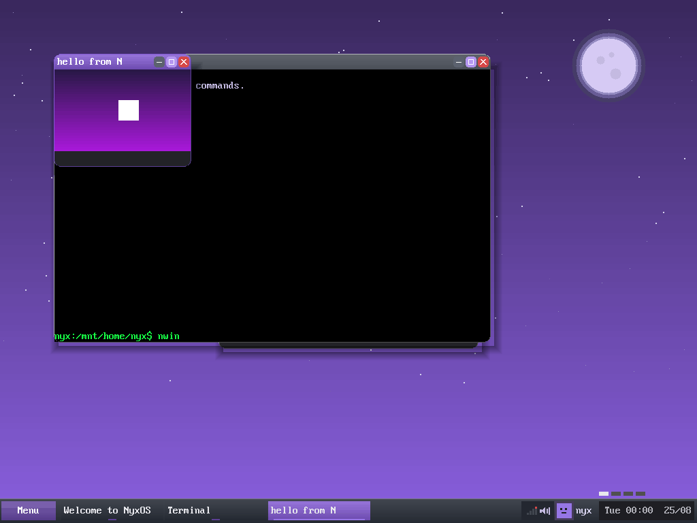

# N & N++ — the native languages of NyxOS

<p align="center">
  
  &nbsp;
  
  &nbsp;
  
</p>

**N** is the native systems language of NyxOS, in the same spirit that HolyC was
the native language of TempleOS: a language designed *for* one operating system,
whose compiler knows that OS from the inside — its syscall table, its ABI, its
memory map — and which ultimately lives *inside* the OS itself, so that programs
are written, compiled, and run without ever leaving NyxOS.

**N++** is its planned superset: N plus the safety and ergonomics layer
(ownership, sum types with `match`, `Result`/`?`, traits, capability checking).
The relationship is deliberately the C/C++ one: every valid N program is a valid
N++ program, and N++ compiles down through the same pipeline.

---

## The two languages at a glance

| | **N** | **N++** |
|---|---|---|
| Role | The metal: kernel modules, drivers, small userland tools | The ergonomics: applications, GUI programs, larger systems |
| File extension | `.n` | `.npp` |
| Compiler | `ncc` (exists — bootstrap) | `n++` (planned, builds on `ncc`) |
| Memory model | Manual, raw pointers | Ownership/borrowing opt-in, `#[user]` checked pointers |
| Error handling | Return codes | `Result<T, E>` + `?` propagation |
| Data types | Primitives, pointers, `str` | + `struct` methods, `enum` sum types, `match`, generics, traits |
| Status | **v0.24 — working** (see below) | **P1–P4 complete, P5 started** (`own` types complete: must-consume, branch-aware moves, `#[drop]` destructors; GUI bindings wait on kernel window syscalls) |

Both share the same DNA:

- **Syscalls are part of the language.** An `extern syscall` block binds kernel
  entry points by number, and the compiler emits the raw x86_64 `syscall`
  instruction inline — no libc in between:

  ```n
  extern syscall {
      fn write(fd: i32, buf: *u8, len: isize) -> i64 = 1
      fn getpid() -> i64                             = 6
  }

  fn main() -> i64 {
      pid := getpid();
      msg := "hello from N! pid={pid}\n";
      write(1, msg.ptr as *u8, msg.len as isize);
      0
  }
  ```

- **The compiler knows NyxOS.** Types like `addr`, constants like the canonical
  user-space boundary, the register ABI, the W^X page-flag rules — these are
  compiler knowledge, not header files (fully realized in N++).

- **Readable surface, systems semantics.** `:=` inference, string
  interpolation, expression blocks — but everything lowers to straightforward C
  today (and to native code eventually) with zero hidden runtime.

## Status — what works today

The bootstrap compiler `ncc` ([ncc/ncc.c](ncc/ncc.c), single-file C, no
dependencies) implements N v0.24 — type inference (typed `:=` bindings with an
`i64` default, interpolation that inserts `str` values as text — with `:x`/`:X` hex and `:wN`/`:zN` width/zero-pad format specs — enforced
`mut`), a complete expression-level checker plus missing-return flow analysis (undeclared names, unknown
callees, arity, argument/operand/return/assignment types — all compile errors
with `file:line` diagnostics), `struct` records with checked literals and
field access, function types (`fn(i64) -> i64` — functions passed, stored in
fields and called through, v0.24), Go-style function-scoped `defer`, `enum` tagged unions with an
exhaustive `match` usable as a statement or as the value of a
binding/assignment/return, statically-dispatched `impl` methods, `?` error
propagation over Ok/Err result enums, counted `for` loops over half-open
ranges, `#[user]` checked-pointer flavors with explicit `as` crossings,
`pageflags` page permissions with a total compile-time W^X proof,
`#[caps(syscall)]`-gated kernel crossings with audited wrapper boundaries,
byte-level indexing into str and pointers with element writes (real
buffers and stacks — the self-hosting enabler), `own` must-consume types
that turn handle leaks and double-use into compile errors,
strict-C99 output — and is verified three ways:

1. **Real programs run on NyxOS.** The in-OS TinyCC builds the current
   `ncc` from source inside the running system, and that compiler
   transpiles, compiles, and runs the **entire example suite** — all
   twenty-two programs, v0.1 through v0.22 — in a single boot, with
   output identical to the host runs: the fs bindings exercise real
   kernel `open`/`read`/`close`, the `pageflags` demo performs a live
   anonymous `mmap` through the W^X-typed flags, the `own`-struct demo
   moves a must-consume handle through its whole life (branch-aware
   consumption and `#[drop]` auto-close included), and the M5 chain — a
   lexer covering comments, string literals, and two-char operators (and
   real `.n` files read off the ext2 disk), a toy compiler whose full
   surface — typed strings with make/compare/measure, the complete
   comparison and logical operator set, else-if chains, comments, and
   disk-file compilation — is exercised on target every batch, a parser
   that builds whole program bodies as a *checked, folded* AST — statements included — and
   compiles them from a token buffer to stack code (refusing unknown
   variables and type errors with located messages, resolving string
   `==`/`!=` to byte-comparing STREQ/STRNEQ and string `+` to a
   table-appending CONCAT — at run time or folded at compile time
   through one shared
   cursor — honoring line comments, carrying the full comparison set,
   and emitting a 10-word program where the unfolded tree needs 19 —
   all verified on target), and the VM that executes the emitted code —
   **runs the whole toy compiler loop inside NyxOS**. (This
   workload also uncovered — and, run after run, profiled to a pin — a
   kernel VFS node-pool exhaustion,
   [#66](https://github.com/kazah-png/nyx-os/issues/66): twenty batch
   censuses narrowed the leak to unreclaimed `/proc` process entries,
   ~4 nodes per exec; the kernel fix (v6.4.364) is **census-verified** —
   the same 67-exec suite that used to end at 478/512 pool nodes now
   ends at 214 with entries recycling — the language toolchain doubles
   as a real regression test for the OS.)
2. **Generated C is clean.** Output compiles warning-free with the OS
   freestanding flags and links with the standard NyxOS `crt0` + `nyxrt`.
3. **Behavioral tests run on the dev machine.** A host shim maps NyxOS syscall
   numbers to Linux ones (the x86_64 `syscall` ABI is identical, only numbers
   differ), so N programs can be executed and checked without booting the OS.

On NyxOS itself, the compiler is one command away — `xbm install ncc` builds
it from source with the in-OS toolchain and installs it to `/mnt/bin`.

See [ncc/README.md](ncc/README.md) for build and test instructions, and
[docs/spec-n.md](docs/spec-n.md) for the complete specification.

## Repository layout

```
lang/
├── README.md            ← you are here: language home
├── docs/
│   ├── spec-n.md        ← N language specification (tracks the compiler)
│   ├── design-npp.md    ← N++ design document (the superset plan)
│   └── selfhost.md      ← M5 planning: the road from toy to self-host
├── ncc/
│   ├── ncc.c            ← bootstrap compiler (hosted, single-file C)
│   ├── README.md        ← build, usage, testing guide
│   └── host/nyxrt.h     ← Linux syscall shim for host-run tests
└── examples/
    ├── hello.n          ← canonical first program
    ├── countdown.n      ← loops, functions, interpolation
    ├── inference.n      ← v0.2 type inference: typed bindings, typed interp, mut
    ├── structs.n        ← v0.5 structs: literals, field access, by-value passing
    ├── defer.n          ← v0.6 defer: LIFO cleanup on every exit path
    ├── enums.n          ← v0.7 enums + match: sum types, exhaustive dispatch
    ├── methods.n        ← v0.8 impl methods: static dispatch, chaining
    ├── matchexpr.n      ← v0.9 match as an expression: bind/assign/return
    ├── results.n        ← v0.10 `?` propagation over Ok/Err result enums
    ├── fsio.n           ← P3 fs bindings: syscall→Result boundary, `?` chains
    ├── forloop.n        ← v0.11 counted for: half-open ranges, break/continue
    ├── userptr.n        ← v0.12 #[user] pointers: the audited syscall boundary
    ├── pageflags.n      ← v0.13 pageflags: W^X proven at compile time, live mmap
    ├── caps.n           ← v0.14 capabilities: #[caps(syscall)]-gated crossings
    ├── bytes.n          ← v0.15 indexing: s[i]/p[i] reads, FNV-1a in pure N
    ├── ntokens.n        ← M5 link 1: an N lexer in N — lexes real .n files from disk
    ├── ncalc.n          ← M5 link 2: precedence parser + evaluator in N
    ├── nemit.n          ← M5 link 3: stack-code emitter in N (read→parse→emit)
    ├── nstack.n         ← v0.16 index writes: a VM in N runs nemit's code
    ├── own.n            ← own structs: leaks/double-use refused, #[drop] auto-close
    ├── nparse.n         ← M5: a complete toy compiler — AST + check pass, diagnostics
    ├── n_toy_demo.toy   ← the program nparse compiles OFF DISK: fn + while +
    │                      string + interpolation, the whole toy surface from a file
    └── nwin.n           ← P5: a REAL desktop window — own+drop handle over syscalls 57-60,
                           60 frames presented and closed clean on target
```

And here is `nwin` running — an N program's window, launched from the Erebus
terminal, composited by Hemera on the NyxOS desktop:



The runtime N programs link against lives with the rest of user space:
[`user/nyxrt.h`](../user/nyxrt.h) / [`user/nyxrt.c`](../user/nyxrt.c)
(freestanding string/format helpers + the syscall primitive).

## The goal: a language that lives inside the OS

NyxOS already self-hosts a C toolchain (TinyCC runs in-OS as `cc`; `xbm`
compiles packages from source on the machine itself). N rides that ladder:

| Milestone | Description | Status |
|---|---|---|
| M0 | Bootstrap `ncc` compiles N v0.1 on the dev machine | ✅ done |
| M1 | Language home in-repo: compiler, spec, examples, docs | ✅ this directory |
| M2 | `ncc` compiles *inside* NyxOS with the in-OS `cc` (tcc) | ✅ done |
| M3 | `ncc hello.n` → running binary, entirely in-OS (the HolyC moment) | ✅ done |
| M4 | N++ front-end: type checker, structs/enums/match, `Result`/`?` | ✅ folded into N itself — the static checker (v0.3–0.4), structs/impl/enums/`match` (v0.5–0.9) and `Result`/`?` (v0.10) shipped in `ncc` rather than a separate front-end; the distinct `.npp` dialect is the M6 era below |
| M5 | Self-hosting: `ncc` rewritten in N | ✅ **done** — the ladder is complete: [selfhost/](selfhost/) holds `lex.n` → `parse.n` → `check.n` → `gen.n`, each held byte-faithful to ncc differentially, and the generator — compiled inside NyxOS by the compiler it reimplements — **reproduces its own 6,624-line C byte-identically on target** (host proof: suite stage [8e]; in-OS proof: batch V55; the story: [docs/selfhost.md](docs/selfhost.md)). The climb, in order — the full toy loop runs: tokenizer ([ntokens.n](examples/ntokens.n)) · parser + evaluator ([ncalc.n](examples/ncalc.n)) · code emitter ([nemit.n](examples/nemit.n)) · a VM that executes the emitted code ([nstack.n](examples/nstack.n), on v0.16 index writes); the tokenizer covers the real lexer surface (comments, string literals, two-char operators) and [nparse.n](examples/nparse.n) **closes the chain token-natively over N's own statement syntax**: `x := 10; y := 4; a := 2 + x; b := a * y; b - 1` lexes into a token buffer, each binding statement compiles to a STORE into a variable table, the tail expression is the program's value, and the VM runs the emitted code — no fixed environment, every name bound by parsed statements — and **control flow compiles with branch patching**: `if`/`while` emit JZ with a placeholder target that is patched once the body is compiled (`while` adds the back-jump), the discipline a real emitter lives by — and **functions with recursion**: `fn f(n) ... f(n - 1) ...` compiles to CALL/RET with entry addresses recorded before bodies (self-calls resolve) and a caller-save convention over the flat variable table (save, bind, call, restore) that makes recursion work with zero frame machinery — factorial(5) recurses on the toy VM, verified inside NyxOS, and the convention generalizes to **multi-parameter calls**: save every callee slot in order, evaluate ALL arguments before binding any (so `gcd(b, a % b)` reads the old values), bind and later restore in reverse because a stack pop hands back the last item first — recursive gcd(48, 18) runs on the toy VM — and **identifiers are interned like ncc's own**: the lexer keeps a real symbol table (names buffer + spans, byte-compare lookup, append on miss) and tokens carry symbol indexes, so `fn fact(n)` and `sum := 0; count := 3;` read in real words while the parser needed no change at all — the token architecture paying rent. The fold-back is UNDERWAY: [docs/selfhost.md](docs/selfhost.md) is the parity audit — what the toy already proves and what still separates it from ncc's front-end — and its first three rungs have ALL landed: **file-driven lexing** (the toy lexes real `.n` files it did not embed), **`else` + diagnostics** (every token carries its source line and bad input gets `line N: error: ...` — first violation wins), and **a postorder AST under the expressions**: the parse rules build parallel node arrays (kind/lhs/rhs/value in one by-value struct, calls with a flat four-slot arg table) and a separate `emit_node` walks the tree in postorder — verified **byte-identical** to the fused emitter's code (same values, same word counts: the architecture moved *under* the outputs), with the caller-save call discipline relocated wholesale from parser to walker (ncc's own parse → gen split, inside the toy) and a first dividend: the parser now checks call arity against the callee ("wrong number of arguments"). **And the check pass the tree exists for landed on its heels**: `check_node` walks every finished expression tree between build and emit — a load of an unbound name (not a parameter, not bound by a prior `:=`) is refused as `line N: error: unknown variable` (nodes carry source lines), with block bindings dying at their closing brace (a binding inside an `if` arm cannot be promised to have run — v0.18's conservative branch rule in miniature), `x := x + 1` self-feeds refused (a name binds only after its right-hand side checks), and function bodies held to their lexical story: parameters + own bindings only, whatever the flat runtime table would allow. And the tree's other dividend, the first **transform**: a fold pass rewrites constant subtrees in place between check and emit — `d := 2 * 3 + 4; d * (10 - 8)` compiles to **10 code words where the unfolded tree emits 19** (verified by diffing a fold-disabled build), with DIV/MOD by a literal zero left unfolded because the compiler must not crash computing what the program would. A fused parser-emitter could never fold: by the time it saw both operands, their PUSHes were already emitted — rewriting history is what holding the program as data buys. **Statements then joined the tree**: bind/if/while are node kinds, blocks are seq chains, and each body is one finished tree over which the passes run in order (`gen_body`: check → fold → emit — ncc's whole shape at toy scale), with the jump-patching craft relocated into the statement walker and the output verified unchanged to the byte. Only fn headers and the fndef hop-over still emit as they parse. And the transform tier reached statements: **dead-arm elimination** — an `if` over a constant condition dissolves into its live arm (rewritten in place into a seq wrapper; the dead arm, still checked because dead code must be legal code, is simply never emitted) and a constant-false `while` vanishes, taking `if 1 > 2 { x := 999; } y := 5; y` from 18 emitted words to 7. And the second value kind arrived: **string literals + `print`** — a quoted literal lexes into a side string table (the interned-names pattern, bundled in a by-value struct because N caps fns at 16 parameters), `print "text";` lowers to a PRINTS opcode over that table, `print 6 * 7;` folds to `PUSH 42` + PRINT, and the toy's VM speaks through the same audited output boundary as everything else. And then the **type column** landed: `nt` types every node (int/str, inferred bottom-up by the check walk), strings became first-class values — bound, loaded, printed, riding the same stack and vars table as integers because a string at run time IS its table index — with a per-name type fixed for life and every int-only operation refusing strings by located error ("cannot use a string in arithmetic or comparison"); `print` is one syntax whose opcode the checker picks by the operand's type. And the first **typed operator** followed: `==` over two strings resolves to a byte-comparing STREQ — the checker rewrites the opcode in the tree (overload resolution at toy scale; emit stays type-blind), `if name == "nyx"` composes with conditions for free since `==` yields an int, and two literal strings fold at compile time. Then `+` became **CONCAT** — the first operator that *makes* a string (result type str, so it binds, prints, compares, chains): the table's write cursors live behind a shared pointer field, seeded by the lexer and advanced by whoever appends — the VM at run time, or the fold pass joining two literals at compile time through the very same cursor. Subset growth has begun: the toy honors line comments (vanishing in the lexer, line counter still ticking), carries the full comparison set — `!=` `<=` `>=` joined as two-char tokens with dedicated, constant-folding opcodes — and is **file-driven end to end**: the lexer takes raw bytes + length (ncc's own SRC shape, one pipeline for embedded demos and disk files alike), so the toy compiles and runs a program its binary does not embed, read through an audited `#[caps]` wrapper — **verified inside NyxOS: the toy compiler read a toy-language source off the real ext2 disk, compiled it through all its passes, and ran it on target**. `else if` chains came free — the else slot always held a statement, so the parser recurses instead of demanding braces, and dead-arm elimination cascades through constant chains. `len(s)` completed the string toolkit (make, compare, measure): a typed builtin with one STRLEN opcode, folding literals to plain numbers at compile time — and bare `!` closed the integer operator set (logical not as a factor, int-only, constant-folding). String equality is **symmetric** now: `!=` over two strings resolves to STRNEQ — the same byte-compare pushing the flipped answer, folding two literals at compile time through one generalized fold arm — so equality is the string-legal comparison pair while ordering stays int-only. And the toy lexes **interpolation** — the real lexer's hardest feature: a string splits at its braces into HEAD/MID/TAIL segment tokens (the lexer switching to expression mode inside each hole, one flag standing in for ncc's mode stack), the parser desugars the pieces into a plain `+` chain with each hole wrapped in an int-to-text ITOS node, and the existing type machinery compiles it — str holes insert as themselves (the checker rewrites their ITOS away in place), int holes convert through one new opcode, and a fully-constant interpolated string **folds to a single ready-made literal** at compile time. The number spellings and comment forms caught up too: `0x` hex and `_` separators lex, fold, and interpolate like any constant, and `/* block comments nest */` by depth with the line counter ticking through. Diagnostics carry **line and column** now (`line 2:9: error: ...` points at the offending token itself — packed `line*1000+col` in the one line array, with `fail()` the single decode point), leaving attributes as the toy lexer's only parity gap. And the **struct arc has begun**: `struct P { x, y }` declares, `P{3, 4}` allocates a flat-word record in a side store (the value on the stack IS its index, the string-table move again), `p.x` reads one slot — with the type column grown to **type ids** (int / str / struct k) so the checker resolves fields against the base's struct, records the slot in the tree, and refuses a record index everywhere a number is expected; `name {` opens a literal only for a *declared* struct, so `if ok { ... }` still means what it meant. Landing it forced the identifier alphabet honest too (`A-Z` and `_` lex now — the toy could not spell `P`). Field **writes** landed on its heels — `p.x = e;` mutates the record through one RSET opcode, the statement gate checking all four tokens so a field *read* in tail position is never taken for a write — and then **declared parameter types** completed the struct story: `fn bump(q: P)` is held to at every call site, the body sees `q` as a `P`, and what crosses is the record's index — reference semantics stated plainly, the callee's mutation visible in the caller. And **enums + `match`** arrived tag-only: a variant is its index typed far from the integers, `match` is its only eliminator (a tag never adds, prints, or interpolates), arms lower to DUP/EQ/JZ chains — and the last arm runs untested because the checker **proved exhaustiveness** before a word of code was emitted (`==` over tags stays refused on purpose — ncc's enums have no `==` either; match is the eliminator in both worlds). With `#[attributes]` lexed and deliberately ignored, **the toy lexer's parity table is complete** — every row covered at its stated scale. And **payload variants** finished the enum: `Msg.num(41)` builds a tag+payload record through the same RNEW that builds structs, `match m { num(x) { ... } }` binds the payload for that arm alone — the enum row joins structs as COMPLETE at toy scale. **And the next mountain is named**: [docs/selfhost.md](docs/selfhost.md) now carries the token-by-token accounting of what separates the toy from parsing **hello.n itself** — six ranked rungs (string escapes · return annotations · discarded casts · str fields · extern blocks serviced by the VM · `fn main` as the program), at the end of which the toy compiles the canonical N program off the disk and it prints. Five of its six rungs are already in: string escapes · N's signatures (`fn dbl(v: i64) -> i64`; landing them forced identifiers fully honest — `i64` is one token now) · `as` casts with N's precedence for free · `str` fields (`.len` IS the len builtin, `.ptr` the stated identity) · and **`extern syscall` blocks in hello.n's own shape, serviced by the VM** — the toy's `write(1, msg.ptr, msg.len)` really prints through the same audited boundary as everything else. **All six rungs are in — and the toy GRADUATED**: `fn main` is the program (a tail-less file with a main compiles to one CALL — the name byte-compared, no lexer special case), a bare `write(...);` is a call statement (the toy's first real lookahead: scan to the matching `)`, ask for the `;` — N's own statement rule), and `run_file` pointed at **hello.n itself** compiles the canonical N program off the disk and it prints `hello from N! pid=7` — through its own write, 33 code words. **The sequel is named**: countdown.n is three rungs away and two are in — `: str` parameter annotations (the toy's second kind joins the call-site checks) and void bodies (statements, no tail, value 0 stated) — and then `mut` + assignment landed with the sweep — `:=` declares immutable, `mut` marks writable, `=` assigns under the checker's eye (ncc's own wording on refusal), the toy's rebinding demos all converted to the honest form at identical word counts — **and countdown.n GRADUATED too**: the second example compiles whole off the disk and counts down to `liftoff! from pid 7` through its own write. Both canonical N programs now compile through the toy — and `defer` closed the last parity row that was ever going to close: ncc's v0.6 rule whole (fn-scoped `defer expr;`, LIFO at exit after the tail value, registration-point names, outermost-block only, nested ones refused in ncc's words), with LIFO falling out of post-order recursion over the statement chain — no defer stack, exactly the static lowering ncc's restriction exists to allow. **And the mountain after the toy is named**: ncc's own passes rewritten in N as real N programs — the module ladder `lex.n` → `parse.n` → `check.n` → `gen.n`, each held to ncc differentially — with the first harness landed: `ncc --tokens` dumps the C lexer's exact stream (kind + line per token) so `lex.n` can be held to it byte for byte over the whole examples directory; the scout says no missing N feature blocks the climb — and **the first module LANDED**: [selfhost/lex.n](selfhost/lex.n), ncc's `next_token` in N (keyword table, nested comments, escapes, the interpolation brace stack, all three attributes), verified **byte-identical to `ncc --tokens` over 23 sources — the whole examples directory and lex.n itself** — a permanent differential stage in the verification suite |
| M6 | The `n++` front-end: [`nppc`](nppc/) lowers `.npp` to N over the verified pipeline | 🚧 **in progress** — the M6.2 skeleton (ncc's lexer whole, identity on the N subset) and the M6.3a–f **generics** have shipped: generic structs, functions, and enums monomorphize by a token-span rewrite (`Box<i64>` → `__g_Box_i64`, uses rewritten, everything else verbatim), calls infer their type arguments from literal arguments, constructions infer theirs from the enclosing return type, and [`result.npp`](examples/result.npp) runs the flagship `Result<T, E>` + `?` end to end. **Modules** (M6.5a) followed: a module is a file, `use "lib.npp";` inlines it once per program (cycles refused, `pub` marks exports) and generics monomorphize across files — [`modmain.npp`](examples/modmain.npp) + [`modlib.npp`](examples/modlib.npp) is the two-file program, and **visibility** (M6.5b–c) holds it honest: an item is visible in its file, `pub` makes it visible to the files that `use` its module, a private or unreached call from another file is refused by name with the fix spelled out, and a module's private items are renamed (`__m_modlib_is_even`) so modules never collide. Generics compose too (M6.3g–h): a template may use another with its own parameters — `wrap<T> -> Box<T>` instantiates `Box` once per `wrap` instantiation ([`gnest.npp`](examples/gnest.npp)), and a generic struct may hold one, `Pair<T> { a: Box<T> }` ([`gfield.npp`](examples/gfield.npp)). Re-exports (M6.5d, `pub use "lib.npp";`) complete the module story: a module's exports travel with whoever uses it ([`modreexp.npp`](examples/modreexp.npp)). Every rung is a differential fence (suite stages [10]–[10n]: `ncc` and the self-hosted `ngen` must agree on the lowered program). Next: closures (M6.4 — N has no function types yet, so that one starts with an N rung). The plan and the rung table: [docs/design-npp.md §6](docs/design-npp.md) |

The self-hosted compiler is itself an installable tool: **`xbm install
ngen`** builds it in-OS (the package ships ncc's emitted C for
`selfhost/gen.n` with the runtime appended — one translation unit,
regenerated from source and byte-verified by the suite on every change),
and `ngen file.n` then transpiles exactly like `ncc file.n -o`, byte for
byte, reading its target from `argv` through the very `arg()` builtins it
knows how to lower.

M2 and M3 were reached with zero changes to the compiler's design: `ncc.c` is
plain C99 in one file, so the in-OS tcc builds it directly, and the same
transpile-to-C pipeline that works on the dev machine works in-OS. The
verified full loop inside a booted NyxOS:

```
cc /mnt/ncc.c -I/usr/src/nyx -o /mnt/bin/ncc     # tcc compiles the N compiler
ncc /mnt/hello.n -o /mnt/hello_gen.c             # ncc transpiles N source
cc /mnt/hello_gen.c /mnt/nyxrt.c -I/mnt -o /mnt/bin/nhello
nhello                                           # → hello from N! pid=8
```

The runtime carries the portability knowledge this took (see `user/nyxrt.h`):
under tcc it spells the fixed-width types directly (no `<stdint.h>` on the
in-OS include path) and loads the syscall ABI's r10/r8/r9 explicitly inside
the asm (tcc cannot satisfy six bound register constraints), and `nyxrt.c`
leaves `environ` to the in-OS `libc.o` to avoid a duplicate symbol.

## Documentation policy

Everything in `lang/` is documented to the same bar: every public construct
specified, every design decision explained with its rationale, every limitation
stated honestly. If a feature is in the compiler, it is in the spec; if it is
planned, it is in the design doc with its staging. Documentation lands in the
same commit as the code it describes.
